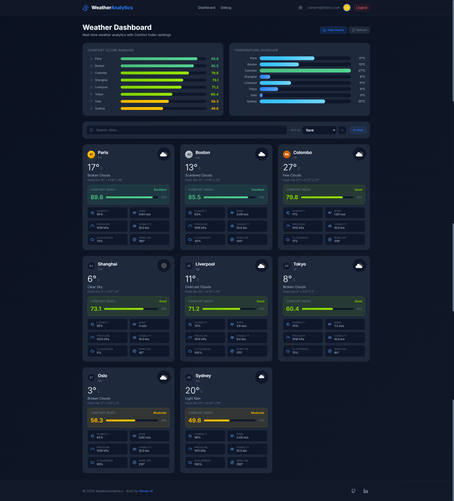
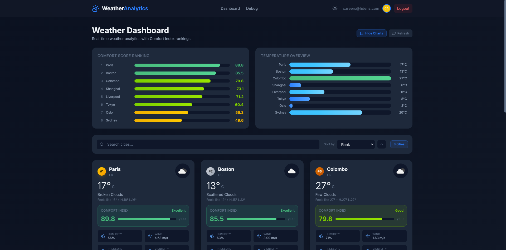
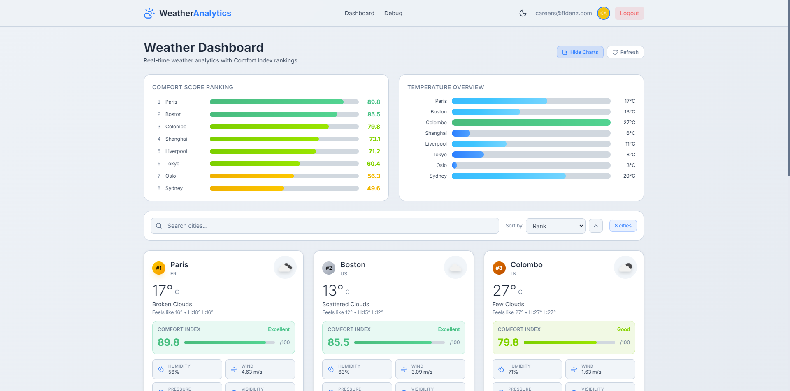
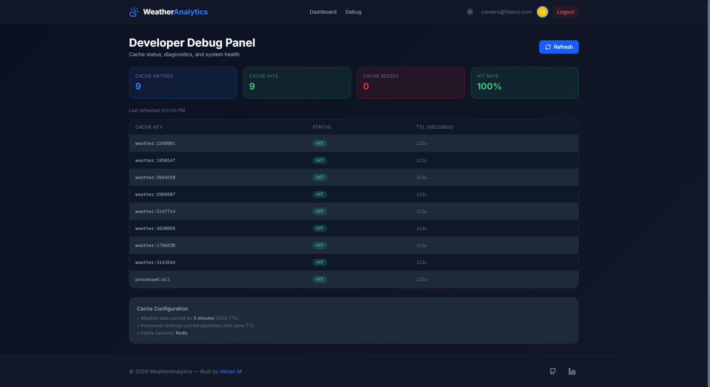

# Weather Analytics Application

A full-stack weather analytics application that retrieves weather data from OpenWeatherMap, computes a custom **Comfort Index Score** for each city, and presents ranked insights through a responsive dashboard.

## Screenshots

### Login Screen


### Dashboard - Dark Mode




### Dashboard - Light Mode


### Debug Panel


---

## Tech Stack

| Layer     | Technology                                                  |
| --------- | ----------------------------------------------------------- |
| Frontend  | Next.js 16, TypeScript, Tailwind CSS                        |
| Backend   | Node.js, Express 5                                          |
| Auth      | Auth0 (NextJS SDK + express-oauth2-jwt-bearer)              |
| Cache     | Redis (via ioredis)                                         |
| Container | Docker, Docker Compose                                      |

---

## Setup Instructions

### Prerequisites

- Node.js 20+
- Redis (local or Docker)
- An [OpenWeatherMap](https://openweathermap.org/) API key
- An [Auth0](https://auth0.com/) tenant with:
  - A **Regular Web Application** (for the frontend)
  - An **API** (for backend JWT validation)

### 1. Clone the repository

```bash
git clone <repo-url>
cd "Weather Web App FullStack"
```

### 2. Configure environment variables

Copy the example file and fill in your credentials:

```bash
cp .env.example .env
```

Docker Compose reads all variables from the **root `.env`** file and injects them into both containers - no separate `backend/.env` or `frontend/.env.local` needed.

**Required values (in root `.env`):**

| Variable                 | Description                                |
| ------------------------ | ------------------------------------------ |
| `OPENWEATHER_API_KEY`    | Your OpenWeatherMap API key                |
| `AUTH0_DOMAIN`           | e.g. `your-tenant.auth0.com`              |
| `AUTH0_CLIENT_ID`        | Auth0 application client ID               |
| `AUTH0_CLIENT_SECRET`    | Auth0 application client secret           |
| `AUTH0_SECRET`           | Random string ≥32 chars for session encryption |
| `AUTH0_AUDIENCE`         | Auth0 API identifier (e.g. `https://weather-api`) |
| `AUTH0_ISSUER_BASE_URL`  | `https://your-tenant.auth0.com`           |
| `APP_BASE_URL`           | `http://localhost:3000`                   |

### 3. Run with Docker (recommended)

```bash
# Production
docker compose up --build

# Development (hot reload)
docker compose -f docker-compose.dev.yml up --build
```

### 4. Run locally (without Docker)

When running without Docker, create local env files from the examples:

```bash
cp backend/.env.example backend/.env
# Then fill in backend/.env with your credentials
```

For the frontend, create `frontend/.env.local` with the Auth0 and backend URL vars.

```bash
# Start Redis
redis-server

# Backend
cd backend
npm install
npm run dev  # runs on :5000

# Frontend (separate terminal)
cd frontend
npm install
npm run dev  # runs on :3000
```

### 5. Auth0 Setup

1. Create a **Regular Web Application** in Auth0 Dashboard.
2. Set callback URL: `http://localhost:3000/auth/callback`
3. Set logout URL: `http://localhost:3000`
4. Create an **API** with the identifier matching `AUTH0_AUDIENCE`.
5. **Disable public signups**: Dashboard → Authentication → Database → your-connection → Disable Sign Ups.
6. **Enable MFA**: Dashboard → Security → Multi-factor Auth → Enable Email.
7. **Create test user**: Dashboard → User Management → Users → Create User:
   - Email: `careers@fidenz.com`
   - Password: `Pass#fidenz`

---

## Docker Deployment

The application ships with two Docker Compose configurations: **production** and **development**.

### Production

Production builds use multi-stage Dockerfiles to create optimised, minimal images.

```bash
# Build and start all services (detached)
docker compose up --build -d

# View logs
docker compose logs -f

# Stop and remove containers
docker compose down

# Stop and remove containers + volumes (wipes Redis cache)
docker compose down -v
```

| Service    | Image / Build         | Port  | Notes                                      |
| ---------- | --------------------- | ----- | ------------------------------------------ |
| `redis`    | `redis:7-alpine`      | 6379  | Persistent volume `redis-data`             |
| `backend`  | `./backend/Dockerfile`| 5000  | `node:20-alpine`, production deps only     |
| `frontend` | `./frontend/Dockerfile`| 3000 | Next.js standalone output, Turbopack build |

All environment variables are read from the root `.env` file by Docker Compose automatically.

### Development (Hot Reload)

Development mode mounts source directories as bind volumes so file changes are reflected instantly without a rebuild.

```bash
# Start with hot reload
docker compose -f docker-compose.dev.yml up --build

# Rebuild a single service
docker compose -f docker-compose.dev.yml up --build frontend

# Run backend tests inside the container
docker compose -f docker-compose.dev.yml exec backend npm test
```

**Key differences from production:**

| Aspect            | Production                  | Development                                |
| ----------------- | --------------------------- | ------------------------------------------ |
| Build target      | Final (multi-stage)         | `builder` stage (includes devDependencies) |
| Backend command   | `node src/app.js`           | `npx nodemon src/app.js` (auto-restart)    |
| Frontend command  | `node server.js` (standalone) | `npm run dev` (Turbopack HMR)            |
| Source volumes    | None (code baked in)        | `./backend/src`, `./frontend/src` mounted  |
| Redis persistence | Named volume `redis-data`   | None (ephemeral)                           |
| `NODE_ENV`        | `production` (default)      | `development`                              |

### Useful Commands

```bash
# Check running containers
docker compose ps

# Restart a single service
docker compose restart backend

# Shell into a container
docker compose exec backend sh

# Prune unused images after rebuilds
docker image prune -f
```

---

## Comfort Index Algorithm

### Overview

The Comfort Index is a **0–100 numerical score** that quantifies how "comfortable" the weather is for humans at a given location. Higher scores indicate more pleasant conditions.

Critically, the algorithm uses the **"feels like" temperature** from OpenWeatherMap rather than the raw temperature. This accounts for the combined effects of humidity (heat index) and wind chill, so a 28°C day with 80% humidity in Colombo is correctly penalised because it *feels* like ~33°C.

### Aggregation: Weighted Geometric Mean

Unlike a simple weighted arithmetic average (where good scores in secondary metrics can mask bad primary scores), this algorithm uses a **weighted geometric mean**:

```
ComfortIndex = exp( 0.35·ln(T) + 0.25·ln(H) + 0.20·ln(W) + 0.10·ln(C) + 0.10·ln(V) )
```

The geometric mean ensures **a single bad parameter drags the composite score down significantly**. For example, 95% humidity (score ≈ 10) will slash the overall score even if temperature, wind, clouds, and visibility are all perfect.

### Sub-Score Parameters

| Parameter              | Weight | Ideal Range | Score at Ideal | Score at Extreme |
| ---------------------- | ------ | ----------- | -------------- | ---------------- |
| Feels-like Temp (°C)   | 35%    | 18–24 °C    | 100            | 0 at −10 °C / 40 °C |
| Humidity (%)           | 25%    | 30–50%      | 100            | 0 at 0% / 100%  |
| Wind Speed (m/s)       | 20%    | 0–3 m/s     | 100            | 0 at 20 m/s     |
| Cloudiness (%)         | 10%    | 0–40%       | 100            | 50 at 100%       |
| Visibility (m)         | 10%    | ≥10 km      | 100            | 0 at 0 m        |

### Sub-Score Details

**Feels-like Temperature** (35% weight - most impactful):
- 18–24 °C → 100 (the thermoneutral zone for a lightly clothed sedentary person)
- Cold side: falls linearly to 0 at −10 °C (28° span)
- Hot side: falls linearly to 0 at 40 °C (16° span - heat is penalised more aggressively)

**Humidity** (25%):
- 30–50% → 100 (tighter ideal range than typical comfort charts)
- 0% or 100% → 0 (both extremes are uncomfortable)

**Wind Speed** (20%):
- 0–3 m/s → 100 (gentle breeze)
- 20+ m/s → 0 (storm-level gusts)

**Cloudiness** (10%):
- 0–40% → 100
- 100% (overcast) → 50 (mild penalty - not as impactful as temperature)

**Visibility** (10%):
- ≥10 km → 100
- 0 m → 0 (fog/smog conditions)

### Compound Penalty Multipliers

After the geometric mean, two exponential multipliers capture compounding discomfort:

1. **Heat-stress multiplier** - activates when `feels_like > 26°C` AND `humidity > 50%`:
   ```
   penalty = exp( −2 × heat_factor × humid_factor )
   ```
   This models how hot-humid conditions are disproportionately worse than either alone. At tropical extremes (40°C, 100% humidity), the score can be reduced by up to ~86%.

2. **Cold-wind multiplier** - activates when `feels_like < 5°C` AND `wind > 5 m/s`:
   ```
   penalty = exp( −1.5 × cold_factor × wind_factor )
   ```
   This models wind chill compounding, where cold + windy is far worse than cold and calm.

### Why these weights?

1. **Temperature dominates** because thermal comfort research consistently shows perceived temperature as the strongest predictor of human comfort outdoors.
2. **Humidity is second** because it directly affects how we perceive temperature (heat index). The tighter 30–50% ideal range ensures tropical cities with 70–90% humidity are properly penalised.
3. **Wind is third** due to wind chill effects in cold weather and general discomfort in high winds.
4. **Cloudiness and visibility** are secondary - they affect mood and outdoor enjoyment but not physical comfort as strongly.

### Why Geometric Mean + Multipliers?

| Approach | Problem |
| -------- | ------- |
| Arithmetic mean | Good secondary scores mask bad primary scores (e.g., Colombo at 28°C + 80% humidity scored 74/100) |
| Geometric mean only | Better, but still can't capture compound effects (hot + humid together is worse than sum of parts) |
| **Geometric mean + exponential multipliers** | Low scores in any dimension drag the total down; compound conditions (heat+humidity, cold+wind) are penalised exponentially |

### Trade-offs Considered

- **Feels-like vs. raw temperature**: Using `feels_like` from OpenWeatherMap means the score already accounts for humidity and wind chill in the temperature component. This creates a slight double-counting with the humidity sub-score, but in practice it produces more realistic rankings.
- **Asymmetric heat penalty**: The hot side of the temperature curve is steeper (16° span to 0 vs. 28° on the cold side). This reflects the fact that extreme heat is more dangerous and uncomfortable than moderate cold.
- **Sub-score floor at 1**: Sub-scores are floored at 1 (not 0) to avoid `ln(0)` in the geometric mean. This means truly extreme conditions score ~1 instead of exactly 0.
- **Cloudiness floor at 50**: Overcast skies reduce the score by at most 50% of the cloudiness weight, acknowledging that cloud cover is subjective and culturally variable.

---

## Cache Design

### Architecture

```
Client → Next.js API Route (with JWT) → Express Backend → Redis Cache → OpenWeatherMap API
```

### Strategy

1. **Raw weather data cache**: Each city's OpenWeatherMap response is cached with key `weather:{cityCode}` and a 5-minute TTL (300 seconds).
2. **Processed results cache**: The fully computed and ranked results array is cached with key `processed:all` and the same 5-minute TTL.
3. **Cache-aside pattern**: The service checks Redis first. On a miss, it fetches from OpenWeatherMap, computes scores, and writes back.
4. **Independent TTLs**: Raw and processed caches expire independently. If the processed cache expires but raw caches are still fresh, only the computation is re-run (not the API calls).

### Debug Endpoint

`GET /api/cache-status` returns HIT/MISS status and remaining TTL for every cache key. Accessible through the frontend's Developer Debug page.

---

## API Endpoints

| Method | Path                    | Auth Required | Description                              |
| ------ | ----------------------- | ------------- | ---------------------------------------- |
| GET    | `/api/weather`          | ✅ JWT        | All cities with weather, score, ranking  |
| GET    | `/api/weather/:cityCode`| ✅ JWT        | Single city weather data                 |
| GET    | `/api/cache-status`     | ✅ JWT        | Redis cache HIT/MISS for each key        |
| GET    | `/api/health`           | ❌            | Health check                             |

---

## Project Structure

```
├── backend/
│   ├── src/
│   │   ├── config/          # App config, Redis client
│   │   ├── controllers/     # Route handlers
│   │   ├── data/            # cities.json
│   │   ├── middleware/      # Auth0 JWT validation
│   │   ├── routes/          # Express routes
│   │   ├── services/        # Weather & cache services
│   │   ├── utils/           # Comfort Index algorithm
│   │   └── app.js           # Entry point
│   ├── tests/               # Jest unit tests
│   ├── Dockerfile
│   └── package.json
├── frontend/
│   ├── src/
│   │   ├── app/             # Next.js App Router pages & API routes
│   │   ├── components/      # React UI components
│   │   ├── lib/             # Auth0 client
│   │   ├── services/        # API service layer
│   │   └── types/           # TypeScript interfaces
│   ├── Dockerfile
│   └── package.json
├── docker-compose.yml       # Production
├── docker-compose.dev.yml   # Development (hot reload)
└── README.md
```

---

## Known Limitations

1. **OpenWeatherMap free tier**: Limited to 60 calls/minute. With 15 cities and a 5-minute cache, this is well within limits.
2. **Dew point**: Not directly available in the free API tier's response. The comfort index uses humidity instead.
3. **Middleware deprecation**: Next.js 16 deprecated the `middleware.ts` convention in favor of `proxy`. The Auth0 SDK still uses middleware, which continues to function but shows a deprecation warning.
4. **No historical data**: The application shows current weather only. Historical trend graphs would require a paid API tier.
5. **Single API key**: All requests use one OpenWeatherMap API key. For production, consider implementing key rotation.

---

## Running Tests

```bash
cd backend
npm test
```

All 31 unit tests cover the Comfort Index sub-score functions and the composite scoring function, including real-world scenarios (e.g., verifying that a hot-humid city like Colombo scores lower than a mild European city).
